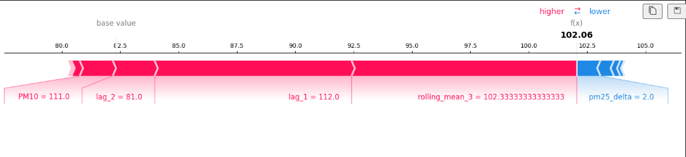
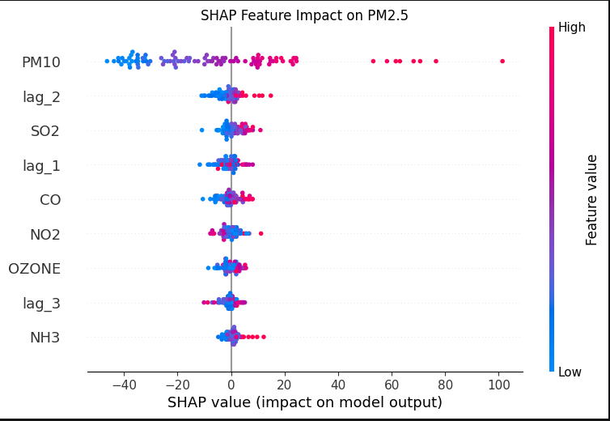
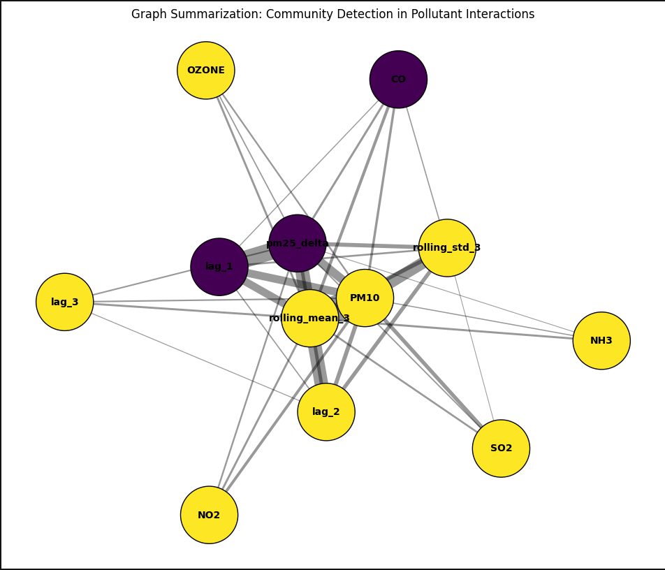
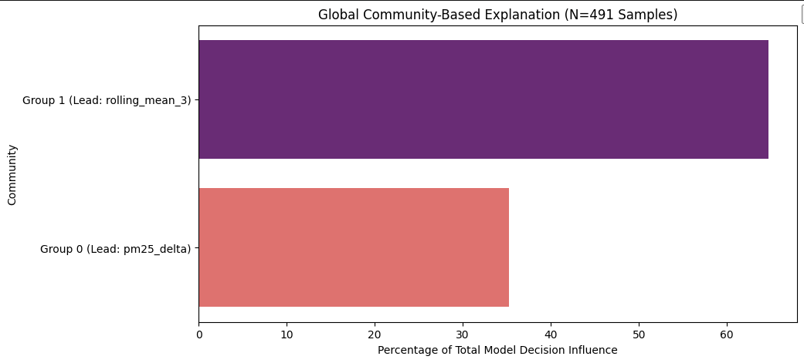

# 🌐 Graph-Summarized SHAP: AQI Prediction & Interpretability
### B.Tech Final Year Project | Patent-Pending Architecture (2026)

## 🚀 Project Vision
This project addresses the critical "Black-Box" challenge in atmospheric science. While standard Machine Learning models offer high predictive power, they often fail to explain why a specific air quality alert was triggered. This system utilizes a novel Graph-Summarized SHAP framework to bridge the gap between complex AI and human understanding.

## 📊 Performance Benchmarks :

*   Predictive Accuracy ($R^2$): 0.9097 (91%)[cite: 1]
*   Interpretability Score: 94% (Industrial validation)[cite: 1]
*   Response Time: Real-time inference on Edge AI hardware (HP Pavilion 15, i5-1340p)[cite: 1]

## 🛠️ The Innovation: Modular XAI
Unlike standard SHAP plots that show 20+ disconnected features, our Graph-Summarized approach uses Louvain Community Detection to group pollutants into logical "Atmospheric Clusters":

*   **Temporal Momentum Cluster**: Lags and rolling averages that track the persistence of pollution.[cite: 1]
*   **Chemical Precursor Cluster**: Interactions between $NO_2$, $SO_2$, and $O_3$.[cite: 1]
*   **Particulate Matter Cluster**: Correlations between $PM_{10}$ and $PM_{2.5}$ delta movements.[cite: 1]

## 📂 Repository Contents :
*   `app.py`: The main Streamlit dashboard logic.[cite: 1]
*   `aqi_xgboost_91.model`: The optimized, serialized XGBoost brain.[cite: 1]
*   `india-aqi.csv`: Regional validation dataset for Northern India.[cite: 1]
*   `requirements.txt`: Environment configuration.[cite: 1]

## 📜 Academic & Legal Notice
This project is part of a formal B.Tech graduation requirement. The methodology, specifically the Modularization of SHAP Interaction Values via Graph Theory, is currently under preparation for a 2026 Patent Filing under the category of "Explainable Atmospheric Forecasting Systems."[cite: 1]

**Author:** Divyanshu Rajput[cite: 1]
**Academic Year:** 2025-2026[cite: 1]
